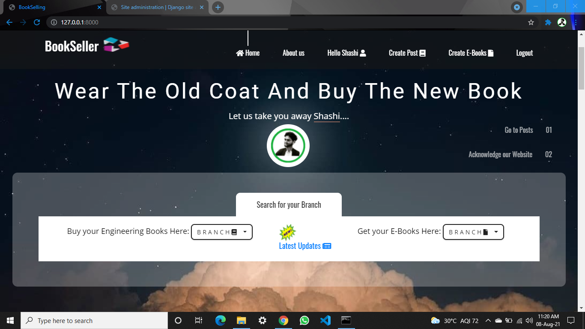
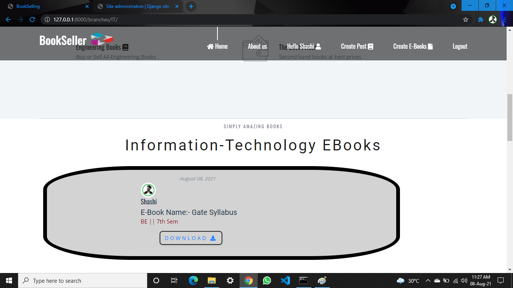
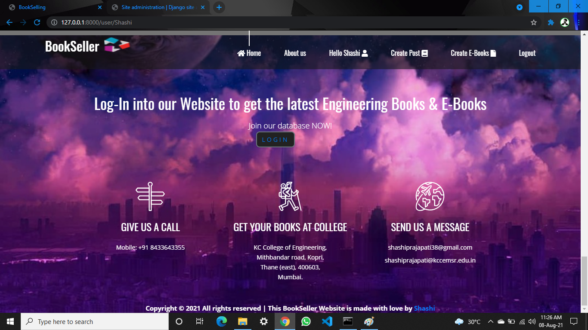

# BookSeller
BookSeller || Django || Python || PostgreSQL (Book and E-Book Selling Website Project)

A BookSelling Website where users/students can visit create their profile and post their second hand books and E-books for sell. And on the other side, previous batches students can buy those books at feasible price.

 ======== ***Problem Statement:*** ===========  
-        Many students faces problem in selection of Books every semester.
-        Not every student can also afford to buy new books at the same time.
-        Some faces the problem in selling their books after each semester, they don’t get enough amount
         back after selling it on the respective shops.

 ======== ***Languages Used:*** ===========  
 HTML-5 
CSS-3 
SCSS-3 
Bootstrap-4 
JavaScript 
Jquery 
Django 
pgAdmin (Database server) MySQL  

 ======== ***Home Page (After Logged In):*** ===========  
After logging In, user will have proper access to all the stuffs avaliable on the web page like posting Books and EBooks, etc.

 ======== ***Recently Posted Books):*** ===========  
In the Home Page itself, you will be able to see the Latest Posted Books by any Branch Students. But You will alsohave to access to filter in all possible ways like filter with particular branch and year, or view all books posted by one user only if price you got by that user would be convenient for you.

User’s will have multiple searching options, they can easily get their books and EBooks by selecting their branch and year.
This make super easy for user’s to get their books.
And at the same page, there they will get books posted by many other user’s which makes easy to compare the books and buy.
In this way, user’s will get the interface to search for books and compare it.
If they likes someone’s price range and wants to buy all the books from that same user, they can easily click on View-All to see all the books posted by that user.

 ======== ***Posts of a single user:*** ===========  

Like if they click on Shashi’s post, they will reach to the page where they will get all the books posted by Shashi with total numbers of books posted.
They can go through all the books and buy required number of books from the one person only if price and quality of books satisfies.

 ======== ***Buy Now:*** ===========  

To buy the books, user’s can directly mail or call that specified user.
If seller is not comfortable to share their contact details to open internet, they can just provide the email through which they login.
Just by clicking on E-mail now, they can write their message and place to meet and deal the books or they can deal in the college premises itself.  

After clicking on E-mail now, it will open their e-mail section where it will automatically fill the email address of receiver or seller.
Subject section also gets automatically filled with the subject they select.
They would just need to specify the meeting place and exchange books. 

 ======== ***E-Books Services:*** ===========  

User’s posted E-Books can be freely downloaded for study purpose.
Student’s can help among each other by sharing notes or E-Books of any subject.
They can also share any image, video file, zip file which can help other’s to grow better.

 ======== ***Latest Updates:*** ===========  

User’s can also get the latest information of their particular college.
If there will be any change in their curriculum or any journal or holiday update, everything they can check over this page.

 ======== ***Footer*** ===========  

 ======== ***Project Done By:*** ===========  

 ======== ***Thank you................................*** ===========  

